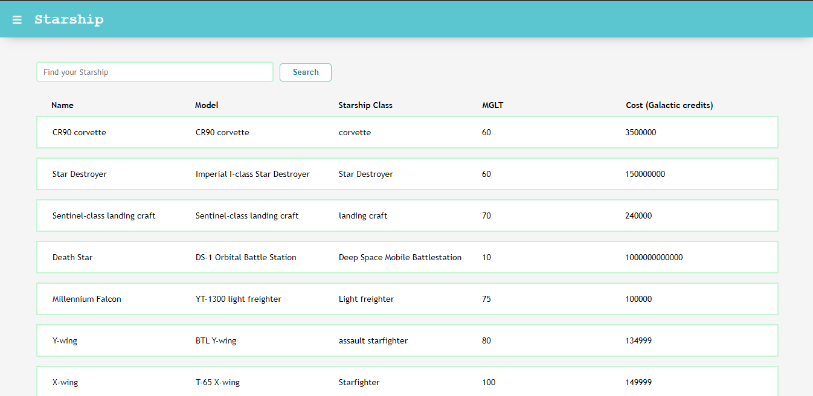
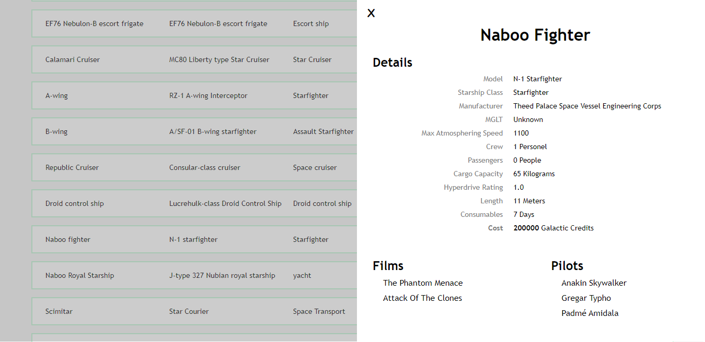

# Starship & Pokemon

Starship & Pokemon is a simple web application that can display starship list and pokemon list in two different menus. In each menu you can see the details of the selected starship or pokemon.

The starship list is taken from the public API [Starship](https://swapi.dev/api), while the pokemon list is taken from the public api [Pokemon](https://pokeapi.co/).

## Screenshot





## Project Setup

```sh
npm install
```

### Compile and Hot-Reload for Development

```sh
npm run dev
```

### Compile and Minify for Production

```sh
npm run build
```
